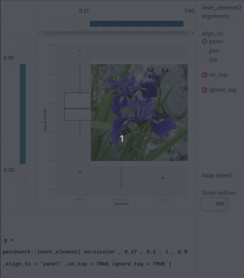

# gginlay
__Add inlays on a ggplot interactively.__

This is a mini R package buid around [patchwork::inset_element()](https://github.com/thomasp85/patchwork). 
When working with ggplot sometimes we want to position an inlay plot at an arbitrary location.
Arguably `patchwork::inset_element()` offers the best solution for it
but the exact coordinates of the inlay needs to be inputted by the user.

`gginlay` makes it easy to place things on a graph by letting you interactively choose where to put them.
Then, it gives you the exact `inset_element()` code to add to your ggplot to make it happen.


``` r
remotes::install_github("mpio-be/gginlay")

gginlay(your_ggplot, your_inlay)

```



